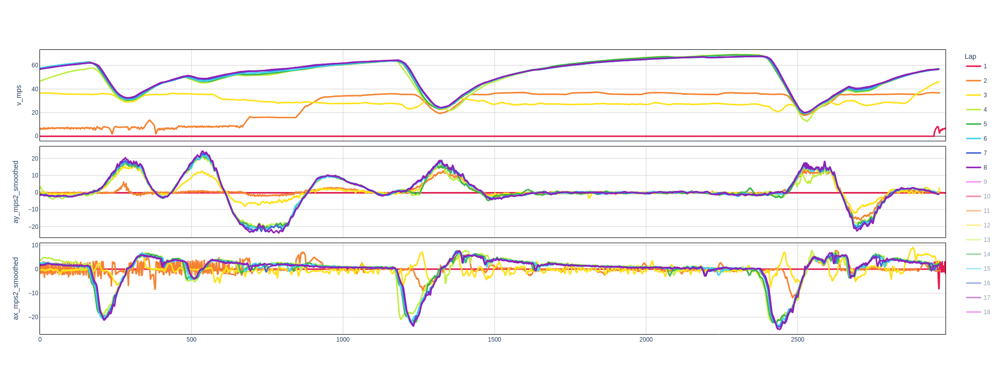
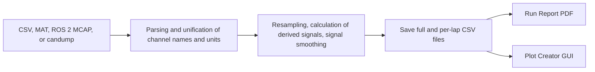
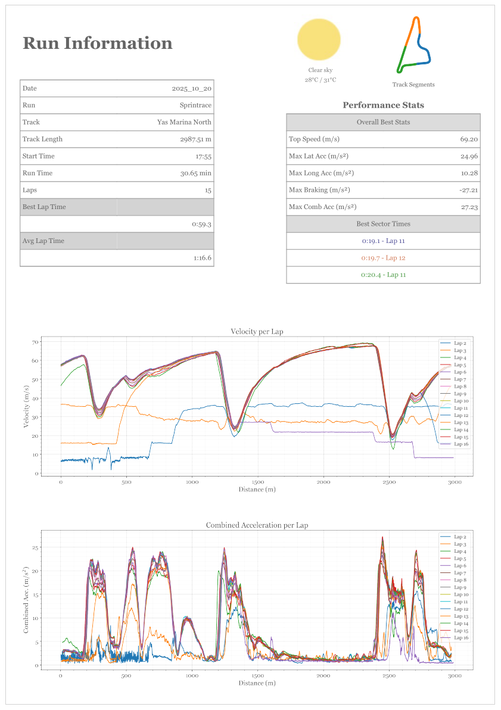
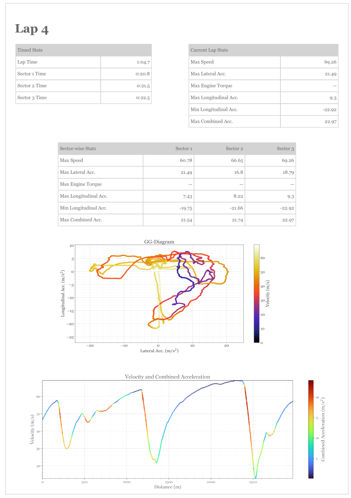
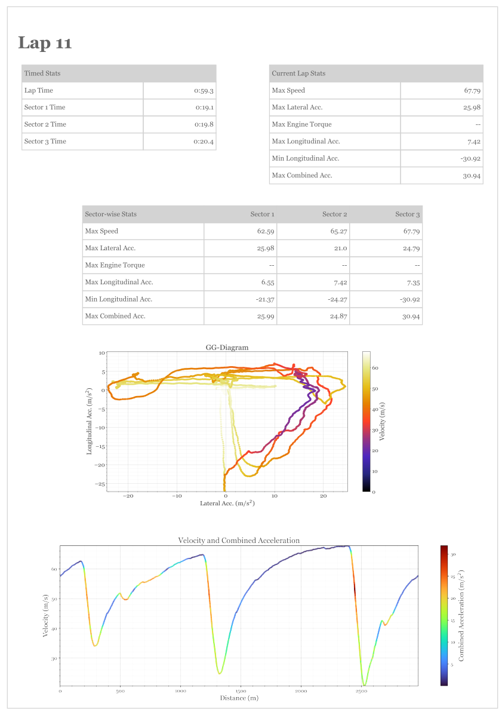
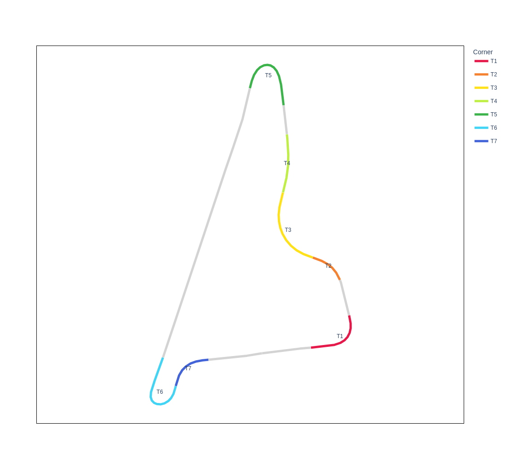
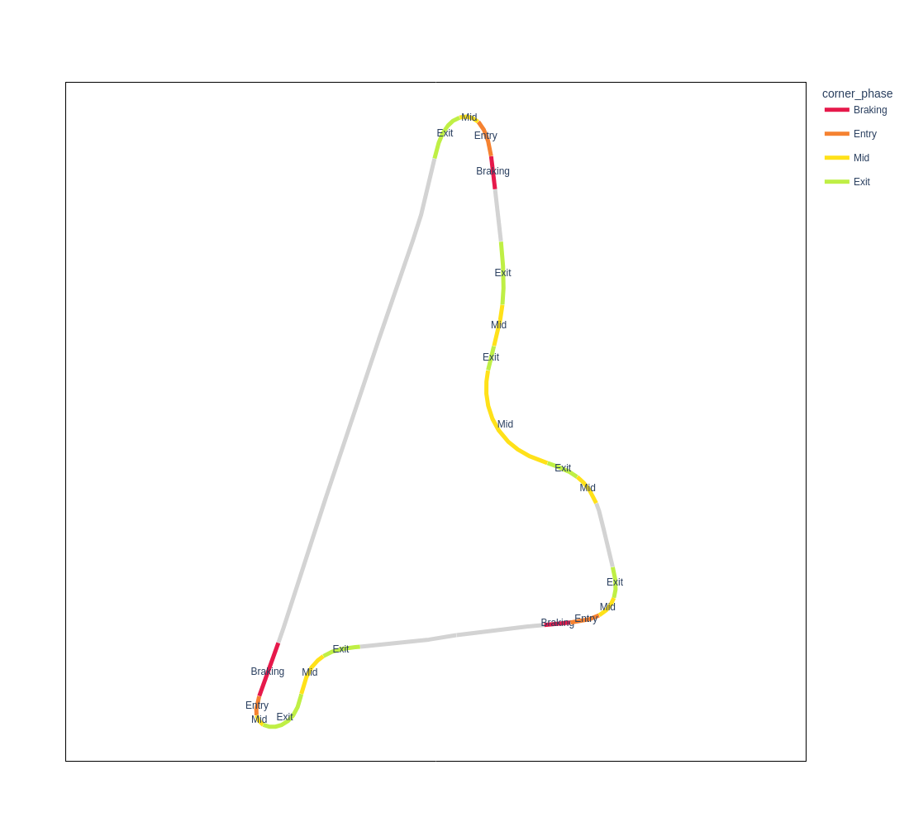
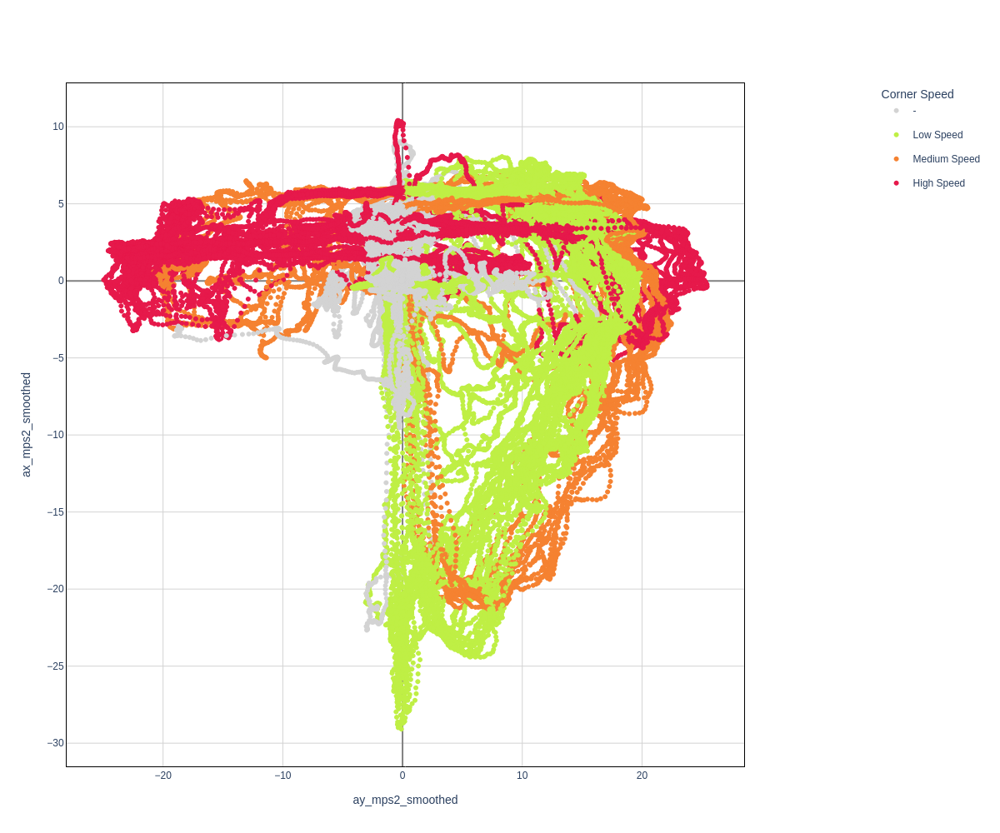
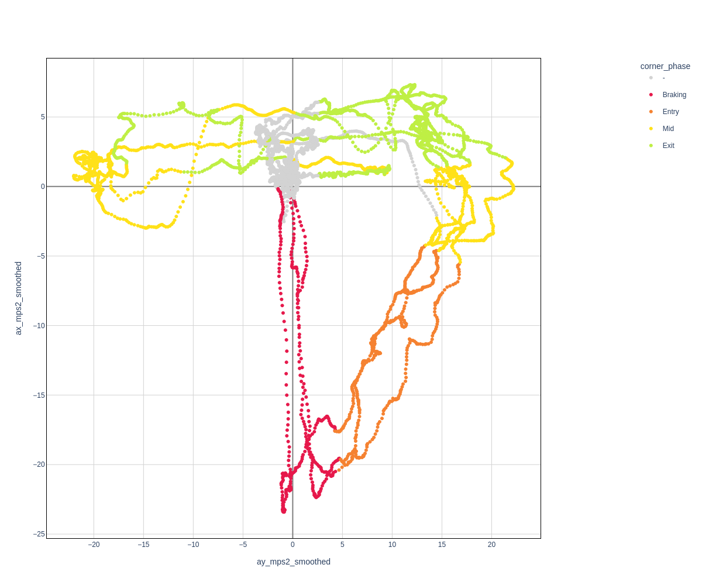
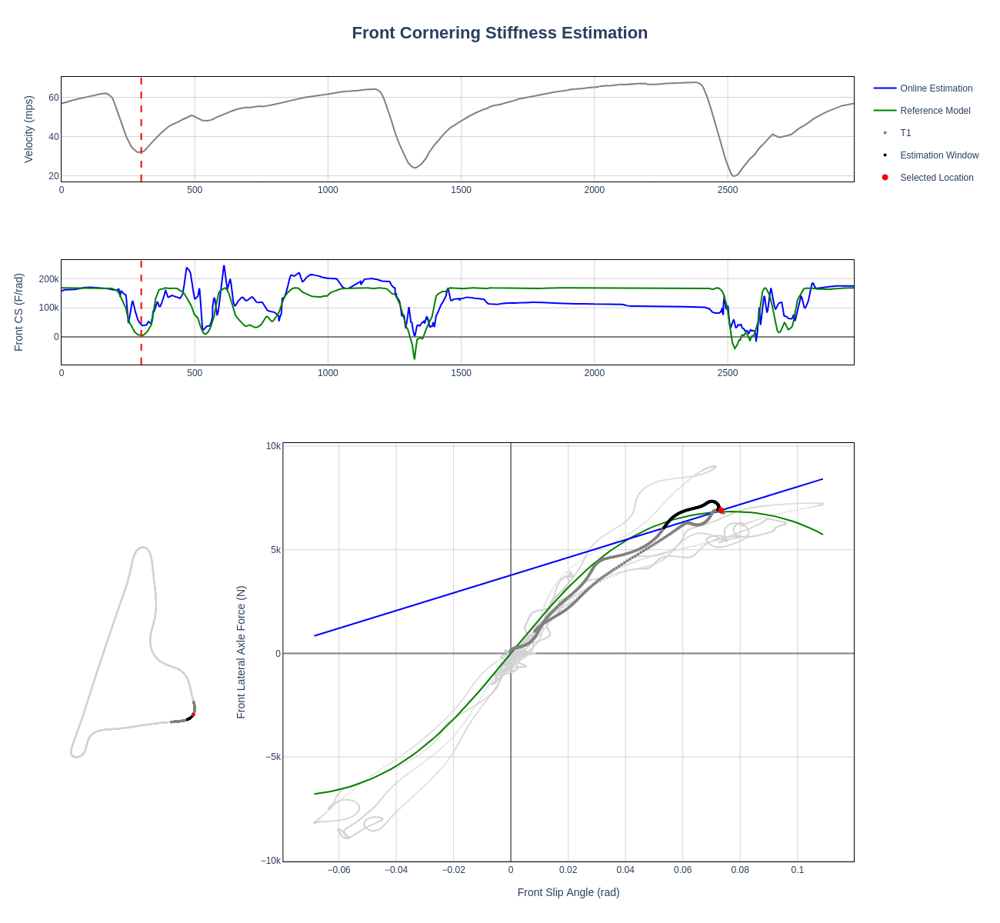

# Vehicle Dynamics Performance Analysis

This tool is a data processing helper and can help with all sorts of annoying and time consuming tasks you commonly encounter when working with vehicle dynamics data. 
Whether it is asynchronous sampling or different sampling frequencies, a changed channel name which torpedoes your layouts, a format which can not be processed directly, only having raw sensor data which offer limited insights, wanting to overlay data from two different cars with different formats or reference frames, or the creation of lap based overlays from continuous data. There are just tons of time consuming tasks before vehicle dynamic data can offer valuable insights. Yes there are commercial tools out there who do some of the things and more, but they are paid and I found them inflexible. This Repository is build from practice and is designed to be modular and extendable, so feel free to tailor it to your needs. If you develop valuable features along the way, I would be happy if you contribute so others can profit as well. It is neither the most sophisticated code, nor the most efficient output, but a workhorse for getting work done and I hope you’ll be gentle with me.

<p align="center">
  
</p>

The application:

- Reads CSV, MATLAB MAT, ROS 2 MCAP, and candump CAN/CAN FD files.
- Converts channel names and unit into a common convention.
- Processing stages:
   - Resamples asynchronous data into one continuous sampling frequency
   - Calculates derived vehicle-dynamics channels
   - Characterization of segments based on vehicle states (braking/entry/mid/exit/straight, low/mid/high speed)
   - Optionally estimates instantaneous cornering stiffness.
   - Lap slicing
   - Smoothing of configured channels
- Writes one unified CSV file and separate per-lap CSV files.
- Optionally creates a Run Report PDF and launches the interactive Plot Creator.



# Setup and Quick start

## Supported Platform

The supported platforms are:

- Ubuntu 22.04 with ROS 2 Humble
- Ubuntu 24.04 with ROS 2 Jazzy

Follow the official installation instructions for
[ROS 2 Humble](https://docs.ros.org/en/humble/Installation/Ubuntu-Install-Debs.html)
or [ROS 2 Jazzy](https://docs.ros.org/en/jazzy/Installation/Ubuntu-Install-Debs.html),
then install the non-ROS prerequisites if they are not already present:

```bash
sudo apt update
sudo apt install git libboost-dev libeigen3-dev libyaml-cpp-dev python3-colcon-common-extensions python3-dev python3-tk python3-vcstool python3-venv
```

Other operating systems and ROS distributions are not currently supported.

## Dependency Layout

Place this checkout and `TAM__common` next to each other:

```text
workspace/
|-- vehicle-dynamics-performance-analysis/
`-- TAM__common/
```

[`dependencies.repos`](dependencies.repos) pins the public
[`TAM__common`](https://github.com/TUMFTM/TAM__common) dependency to a provenn commit. From this repository's root,
import that revision into the parent directory and initialize its pinned
submodules recursively:

```bash
vcs import .. < dependencies.repos
git -C ../TAM__common submodule update --init --recursive
```

`TAM__common` already contains its own pinned `TAM__msgs` copy as a submodule.

## Environment Setup

Run the setup script from the repository root:

```bash
bash setup.sh
```

The script:

1. Resolves `TAM_COMMON_PATH`, defaulting to `../TAM__common`.
2. Requires that checkout to be at the pinned commit and verifies every
   recursive submodule is initialized at its recorded revision.
3. Sources Humble or Jazzy from `/opt/ros` when available. Otherwise, it uses
   the current shell environment.
4. Creates `venv` if absent, or reuses an existing valid `venv`.
5. Installs the pinned application and Python build dependencies from
   `requirements.txt` and marks the virtual environment with `COLCON_IGNORE`.
6. Builds `tum_types_py`, `vehicle_handler_py`, and their selected package
   dependencies into isolated `venv/colcon` build and install directories.

For every new shell, activate the virtual environment and colcon overlay or add it to your bashrc:

```bash
source venv/bin/activate
source venv/colcon/install/setup.bash
```
Run all application commands from
the repository root.

> [!WARNING]
> `config/vehicle_handler/GenericVehicle` is synthetic and non-calibrated. Its
> dimensions, mass, tire, actuator, and dynamics values do not describe a real
> vehicle. Use it only for the included synthetic example, software tests, and
> demonstrations. Do not use it for control tuning, safety decisions, vehicle
> validation, or interpretation of real telemetry.

For real logs, provide a reviewed vehicle configuration containing both
`vehicle_config.yaml` and `tire_config.yaml`; see
[Configuration Overrides](#configuration-overrides).

## Example with synthetic Rosbag

The checked-in
[`examples/synthetic_rosbag/synthetic_vehicle.mcap`](examples/synthetic_rosbag/synthetic_vehicle.mcap)
contains three generic laps using only standard `std_msgs/msg/Float64`
schemas. Generation details are in the [synthetic example guide](examples/README.md).

After setup and environment activation, start the GUI:

```bash
python main.py
```

Expected GUI flow:

1. In **Select the Logs Directory**, choose `examples/synthetic_rosbag`.
2. Choose `GenericVehicle` and leave **Estimate instantaneous cornering
   stiffness** unchecked for the shortest quickstart. The `synthetic_ros2`
   parser profile is selected automatically.
3. Wait for conversion to finish. 
4. Choose **No** at the Run Report prompt for the shortest path, or choose
   **Yes** to exercise report generation.
   The report is also generated without `OPENWEATHER_API_KEY`, using fallback
   weather values.
5. Choose **Yes** at the Plot Creator prompt to open the generated full log, or
   **No** to finish.

Expected converted output:

```text
examples/synthetic_rosbag/unified_format/
|-- synthetic_vehicle.csv
`-- laps/
    |-- synthetic_vehicle_lap_1_*.csv
    |-- synthetic_vehicle_lap_2_*.csv
    `-- synthetic_vehicle_lap_3_*.csv
```

When requested, the Run Report is written beside `unified_format` as
`Run_Report_<date>_Run_<session>.pdf`.

# Further Details

## Parsing

A unified CSV contains source channels renamed to common names, configured unit
conversions, retained source data, and any derived signals whose prerequisites
are available. Because the later derived channel calculations are conditional, different parser profiles
can produce different output channels.

### Supported Input Formats

Select a directory rather than an individual file. Every supported file in that
directory is processed in natural filename order.

| Input | Contract |
| --- | --- |
| `.csv` | Comma- or tab-separated columns with a header matching one parser profile. |
| `.mat` | MATLAB file with top-level numeric signals stored as two-column timestamp/value arrays. |
| `.mcap` | ROS 2 MCAP with decodable schemas. Only topics in [`config/topic_list.csv`](config/topic_list.csv) are read and flattened. |
| `.log`, `.candump` | Timestamped compact or bracketed candump CAN/CAN FD logs decoded with a selected JSON signal definition. |

When a CAN log is read, the application prompts for its JSON signal definition.
The JSON format is documented in the [standalone tools guide](tools/README.md#can-log-conversion).

Source names and conversion factors are defined in
[`config/parser_config.csv`](config/parser_config.csv). A profile matches only
when all of its non-empty source names exist. Smoothing windows in seconds are
defined in [`config/filter_config.csv`](config/filter_config.csv).

## Processing Pipeline

Each supported input file is processed in this order:

1. Load the selected vehicle configuration.
2. Read the input data. For MCAP files, decode only configured topics; for CAN
   logs, decode frames using the selected JSON signal definition.
3. Select a matching parser configuration.
4. Rename source channels and apply unit conversions.
5. Resample and interpolate sparse data when required.
6. Calculate vehicle-dynamics signals whose required inputs are available.
7. Establish the common distance reference and slice data into laps.
8. Smooth configured signals.
9. Characterize corners and, if enabled, estimate front and rear instantaneous
   cornering stiffness.
10. Write the complete converted log and its per-lap CSV files.

If neither `s_m` nor `s_norm_m` distance coordinate is available a GUI windows opens to draw a finish line. This will get used to differentiate the distance and lap signal.

Most multi-output calculation families are skipped if one of their outputs
already exists. The complete pipeline requires `time_s` and a usable `s_m` or
`s_norm_m` distance coordinate before it can write per-lap files.

### Multi-Run Conversion

To compare sessions or cars on a common distance axis, place all logs for the
same track in one input directory. The first processed log containing `s_m`,
`pos_x_m`, and `pos_y_m` becomes the reference, so name the intended reference
to sort first, for example `00_reference.mcap`. Positions in following logs are
mapped to this reference and written as `s_norm_m`.

All logs must use the same XY coordinate frame. If only latitude and longitude
are available, enter the exact same `lat, lon` origin for every log when
prompted. This gives sessions from different cars a shared position reference.

Conversion writes one CSV per input and does not merge runs. Use `s_norm_m` as
the x-axis when overlaying converted files. Run Report has an additional
multi-file limitation described in [Run Report](#run-report).

## Calculated derived Channels

The tables below list every fixed-name column calculated by `DataFile` and the
subsequent processing steps. Wheel suffixes use `fl`, `fr`, `rl`, and `rr` for
front-left, front-right, rear-left, and rear-right. Vehicle parameters refer to
the selected vehicle and tire configuration.

### Motion and Path

| Signal | Required inputs | Description |
| --- | --- | --- |
| `pos_x_m`, `pos_y_m` | `pos_lat`, `pos_long`, user-provided geographic origin | Local east and north coordinates from an equirectangular WGS84 projection. |
| `vy_mps` | `vx_mps`, `beta_rad` | Lateral velocity: `vx_mps * tan(beta_rad)`. |
| `v_mps` | `vx_mps`, `vy_mps` | Total speed: `hypot(vx_mps, vy_mps)`. |
| `beta_rad` | `vx_mps`, `vy_mps` | Vehicle sideslip: `atan2(vy_mps, vx_mps)` when `vx_mps >= 3 m/s`; otherwise zero. |
| `a_total_mps2` | `ax_mps2`, `ay_mps2` | Combined acceleration magnitude: `hypot(ax_mps2, ay_mps2)`. |
| `radius_m` | `v_mps`, `ay_mps2`, `beta_rad` | Signed turn radius `v_mps^2 / (ay_mps2 * cos(beta_rad))`; zero below `3 m/s` or at zero lateral acceleration and clipped to `+/-10,000 m`. |
| `curvature`, `curvature_smoothed` | `radius_m` | Signed inverse turn radius in `1/m`, with zero used for zero radius, plus its centered 30-sample moving average. |

### Tire Slip and Wheel Motion

| Signal | Required inputs | Description |
| --- | --- | --- |
| `alpha_fl_rad`, `alpha_fr_rad`, `alpha_rl_rad`, `alpha_rr_rad` | `vx_mps`, `vy_mps`, `yaw_rate_radps`, `delta_f_rad`, vehicle parameters | Vehicle-handler wheel slip angles, set to zero when `vx_mps < 3 m/s`. |
| `alpha_f_rad`, `alpha_r_rad` | `alpha_fl_rad`, `alpha_fr_rad`, `alpha_rl_rad`, `alpha_rr_rad` | Arithmetic left/right mean for each axle. |
| `whl_slip_fl`, `whl_slip_fr`, `whl_slip_rl`, `whl_slip_rr` | All four wheel linear speeds plus `vx_mps`, or all four wheel angular speeds plus `vx_mps`, `vy_mps`, `yaw_rate_radps`, `delta_f_rad`, and vehicle parameters | Longitudinal slip ratio for all four wheels. The linear-speed route uses `(wheel_speed - vx_mps) / vx_mps` and clips to `[-1, 1]`; both routes return zero when `vx_mps < 3 m/s`. |
| `whl_slip_combined_fl`, `whl_slip_combined_fr`, `whl_slip_combined_rl`, `whl_slip_combined_rr` | Corresponding `whl_slip_*` and `alpha_*_rad` columns | Implemented combined-slip metric `sqrt(tan(whl_slip)^2 + alpha^2)`. |
| `long_slip_velocity_fl`, `long_slip_velocity_fr`, `long_slip_velocity_rl`, `long_slip_velocity_rr` | `v_mps`, corresponding `whl_slip_*` columns | Longitudinal slip velocity in `m/s`: `whl_slip * v_mps`. |
| `lat_slip_velocity_fl`, `lat_slip_velocity_fr`, `lat_slip_velocity_rl`, `lat_slip_velocity_rr` | `v_mps`, corresponding `alpha_*_rad` columns | Lateral slip velocity in `m/s`: `v_mps * tan(alpha)`. |
| `combined_slip_velocity_fl`, `combined_slip_velocity_fr`, `combined_slip_velocity_rl`, `combined_slip_velocity_rr` | `v_mps`, corresponding `whl_slip_combined_*` columns | Combined-slip metric multiplied by total vehicle speed, in `m/s`. |
| `whl_fl_radius_m`, `whl_fr_radius_m`, `whl_rl_radius_m`, `whl_rr_radius_m`, `whl_f_radius_m`, `whl_r_radius_m` | `v_mps`, all four wheel angular speeds | Zero-slip wheel-radius estimates `v_mps / wheel_radps` at or above `3 m/s`, plus front- and rear-axle arithmetic means. |
| `alpha_f_weighted_rad`, `alpha_r_weighted_rad` | Wheel slip angles, `fz_f_N`, `fz_r_N`, and all four wheel vertical loads | Vertical-load-weighted wheel slip angle for each axle. |
| `whl_slip_weighted_front`, `whl_slip_weighted_rear` | Wheel slip ratios, `fz_f_N`, `fz_r_N`, and all four wheel vertical loads | Vertical-load-weighted longitudinal slip ratio for each axle. |

### Forces and Utilization

| Signal | Required inputs | Description |
| --- | --- | --- |
| `yaw_accel_radps2` | `yaw_rate_radps`, `time_s` | Gradient of yaw rate using the median time step for the complete log. |
| `fy_f_N`, `fy_r_N`, `fy_N` | `ay_mps2`, `yaw_accel_radps2`, mass, wheelbase, CoG position, yaw inertia | Bicycle-model front, rear, and total lateral forces in newtons. |
| `fz_f_N`, `fz_r_N`, `fz_fl_N`, `fz_fr_N`, `fz_rl_N`, `fz_rr_N` | `v_mps`, `ax_mps2`, `ay_mps2`, vehicle mass, geometry, and aerodynamic parameters | Estimated positive-downward axle and wheel loads in newtons, including static load, aerodynamic load, longitudinal transfer, and the implemented lateral-transfer approximation. |
| `fy_f_norm_N`, `fy_r_norm_N`, `fy_norm_N` | Axle lateral and vertical loads | Dimensionless `Fy/Fz` ratios. The historical `_N` suffix does not represent their unit. |
| `mue_effective` | `a_total_mps2`, `fz_f_N`, `fz_r_N`, vehicle mass | Effective utilization `(mass * a_total_mps2) / (fz_f_N + fz_r_N)`. |
| `lateral_slip_efficiency_front`, `lateral_slip_efficiency_rear`, `lateral_slip_efficiency_vehicle` | Axle lateral and vertical loads, `alpha_f_weighted_rad`, `alpha_r_weighted_rad` | Axle `Fy / weighted_alpha` in `N/rad` when `abs(alpha) >= 0.01 rad`, plus a vertical-load-weighted vehicle value. |
| `wheel_slip_efficiency_front`, `wheel_slip_efficiency_rear`, `wheel_slip_efficiency_vehicle` | Axle lateral and vertical loads, `whl_slip_weighted_front`, `whl_slip_weighted_rear` | Axle lateral force divided by weighted longitudinal slip ratio, in newtons, when `abs(slip) >= 0.01`, plus a vertical-load-weighted vehicle value. |
| `lateral_slip_efficiency_norm_front`, `lateral_slip_efficiency_norm_rear`, `lateral_slip_efficiency_norm_vehicle` | Lateral-slip efficiencies and axle vertical loads | Axle lateral-slip efficiency divided by vertical load, in `1/rad`, plus a vertical-load-weighted vehicle value. |

### Stabillity Metrics

| Signal | Required inputs | Description |
| --- | --- | --- |
| `alpha_diff_rad` | `alpha_f_rad`, `alpha_r_rad`, `curvature_smoothed` | `(alpha_f_rad - alpha_r_rad) * sign(curvature_smoothed)`. |
| `understeer_gradient` | `ay_mps2`, `delta_f_rad`, `v_mps`, vehicle wheelbase | Instantaneous steady-state estimate `delta_f_rad / ay_mps2 - wheelbase / v_mps^2` in `rad/(m/s^2)`. It is unavailable at or below `3 m/s` or below `1 m/s^2` absolute lateral acceleration. |
| `delta_f_kinematic_rad` | `curvature_smoothed`, vehicle wheelbase | Small-angle kinematic steering reference `wheelbase * curvature_smoothed`. |
| `excess_steering_angle_rad` | `delta_f_rad`, `delta_f_kinematic_rad`, `curvature_smoothed` | Direction-normalized measured steering beyond the kinematic reference. |
| `yaw_rate_kinematic_radps` | `delta_f_rad`, `v_mps`, vehicle wheelbase | Neutral-steer small-angle reference `v_mps * delta_f_rad / wheelbase`; zero at or below `3 m/s`. |
| `yaw_rate_diff_kinematic_radps` | `yaw_rate_kinematic_radps`, `yaw_rate_radps`, `curvature_smoothed` | `(yaw_rate_kinematic_radps - yaw_rate_radps) * sign(curvature_smoothed)`. |
| `r_cos_phi` | `ax_mps2`, `ay_mps2` | Acceleration-direction ratio `ax_mps2 / hypot(ax_mps2, ay_mps2)`: -1 for braking, 0 for pure cornering, and 1 for acceleration. It is undefined when both inputs are zero. |

### Further Processing

| Signal | Required inputs | Description |
| --- | --- | --- |
| `s_norm_m` | Reference log: `s_m`, `pos_x_m`, `pos_y_m`; later logs: `pos_x_m`, `pos_y_m` | Common distance coordinate. The first suitable log trains a three-neighbor position-to-distance model; later logs use that model. |
| `n_lap` | `s_norm_m` when available, otherwise `s_m` | One-based lap number. A new lap is detected at a distance drop greater than `300 m`, with qualifying resets separated by at least 100 samples. |
| `<signal_name>_smoothed` | An available signal listed in `config/filter_config.csv`, `time_s` | Centered whole-log moving average with `round(window_length_s * sample_frequency)` samples and at least one value per edge window. Smoothing can span a lap boundary. |
| `corner_name`, `corner_speed`, `corner_phase` | `n_lap`, `s_m`, `curvature_smoothed`, `ay_mps2_smoothed`, `v_mps`, `r_cos_phi_smoothed` | Categorical corner labels. Values include `T1`, `T2`, etc.; `Low Speed`, `Medium Speed`, or `High Speed`; and `Braking`, `Entry`, `Mid`, or `Exit`. Unclassified samples use `-`. |

## Run Report

After at least one successful conversion, the application can generate one Run
Report PDF. The dialog requires the following manual inputs:

- Date in `YYYY-MM-DD` form
- Session number
- Start time in `HH:MM:SS` form
- Track name
- City

The entered date and session are used literally in
`Run_Report_<date>_Run_<session>.pdf`; they are not inferred from telemetry.

Lap CSVs are rejected when they are empty, lack `time_s` or `s_m`, last less
than 10 seconds, or contain a positive distance jump greater than 100 m. After
initial validation, laps covering less than 5 percent of the longest valid lap
distance are removed. The resulting report contains run and performance
summaries, best and average lap times, three-sector comparisons, speed and
combined-acceleration plots, and a page of plots and KPIs for each valid lap.

| Session summary | Lap 4 analysis | Lap 11 analysis |
| --- | --- | --- |
|  |  |  |

### Optional Weather Lookup

To query OpenWeather using the city entered in the report dialog, export:

```bash
export OPENWEATHER_API_KEY=your_api_key
```

If the variable is unset or empty, lookup is skipped without a network request
and fallback weather values are used. When set, only the city name is sent to
OpenWeather; telemetry is not uploaded. Never commit API keys.

## Plot Creator

The main workflow offers to launch Plot Creator after successful conversion. It offers:
- Time Series Plots
- Track Map Plots
- Scatter Plots
- Cornering Stiffness Evaluator plots
  
Multiple Filtering and Gating Tools:
- Laps
- Corner Phases
- Corner Speed
- Corner Number

It can also be started directly with an optional path with a converted CSV file:

```bash
python tools/plot_creator.py
python tools/plot_creator.py examples/synthetic_rosbag/unified_format/synthetic_vehicle.csv
```

Few examples:

| Corner names | Corner phases | GG by corner speed | GG by corner phase |
| --- | --- | --- | --- |
|  |  |  |  |

Generated interactive Plotly HTML files remain local unless explicitly shared.

## Instantaneous Cornering Stiffness Estimation

Cornering stiffness describes how strongly lateral tire force changes with tire
slip angle. In the approximately linear operating region it is the slope of the
lateral-force versus slip-angle relationship. Tracking this relationship over
time can indicate when tire behavior is becoming nonlinear.

The estimate is optional per log and disabled by default because it can
substantially increase conversion time. It requires front and rear axle slip
angles, bicycle-model lateral forces, and timestamps. Results depend on signal
quality, vehicle parameters, and sufficient cornering excitation; treat them as
analysis estimates rather than direct measurements or calibrated static tire
properties.

The estimator processes the complete log and can span lap boundaries. It infers
sampling frequency from `time_s`, applies a fourth-order 2 Hz zero-phase
Butterworth filter, and uses dynamically sized left-sided windows with a default
minimum slip-angle interval of 0.02 rad. Sampling frequency must exceed 4 Hz and
the input must be long enough for zero-phase filtering. Although each fitting
window uses current and past samples, filtering uses future samples, so this is
an offline per-sample estimate rather than a causal real-time estimator.

The final result combines two estimation methods in a weighting step:

1. **Full-window estimation:** Fit one least-squares slope over the complete
   dynamic window.
2. **Section estimation:** Split the window when slip-angle growth direction
   changes, fit each section, and combine section slopes by slip-angle interval.
3. **Final weighting:** Combine both estimates according to the full-window
   coefficient of determination (`R2`).

| Signal | Required inputs | Description |
| --- | --- | --- |
| `cs_f_Nprad`, `cs_r_Nprad` | Axle slip angles, axle lateral forces, and timestamps | Estimated instantaneous front- and rear-axle cornering stiffness in `N/rad`. |
| `cs_ratio_f`, `cs_ratio_r` | Axle slip angles, axle lateral forces, and cornering-stiffness estimates | Estimated stiffness relative to a linear-region reference based on a 0.021 rad slip-angle threshold. A value near 1 represents that reference; lower values indicate a reduced fitted slope. Zero or negative values do not independently identify the physical force peak. |

These columns are absent when estimation is not selected or required inputs are
unavailable. For implementation details, see
[`InstantaneousCorneringStiffnessEstimator`](src/cornering_stiffness_estimator.py).

#### Inspecting an Estimate

Open the converted full-log CSV in Plot Creator and choose **CS Evaluator**.
Select the front or rear axle, a lap, and a distance location. The resulting
view relates estimated and reference stiffness to velocity, track position, the
active estimation window, and lateral force versus slip angle.

<p align="center">
  
</p>

The method is based on:

- W. Sienel, "Estimation of the tire cornering stiffness and its application to
  active car steering," in *Proceedings of the 36th IEEE Conference on Decision
  and Control*, 10-12 Dec. 1997, pp. 4744-4749.
- L. Haffner, M. Kozek, J. Shi, and H. P. Jorgl, "Estimation of the maximum
  friction coefficient for a passenger vehicle using the instantaneous
  cornering stiffness," in *2008 American Control Conference*, pp. 4591-4596.
- L. Wimmer, "Development of robust metrics for quantifying the vehicle
  stability of autonomous vehicles," Master's thesis, Technische Universitaet
  Muenchen, Munich, 2025.


## Standalone Analysis Tools

The `tools/` directory also provides command-line utilities for an
interactive satellite trajectory overlay and optional standalone candump
CAN/CAN FD conversion. The main application can parse the same CAN logs
directly.
Their input contracts, examples, and map privacy notes are documented in the
[standalone tools guide](tools/README.md).

## Configuration Overrides

Defaults are repository-relative. These environment variables support local
configuration without editing tracked files:

| Variable | Purpose |
| --- | --- |
| `VDPA_CONFIG_DIR` | Directory containing `parser_config.csv`, `topic_list.csv`, and `filter_config.csv`. |
| `VDPA_VEHICLE_CONFIG_DIR` | Directory whose child vehicle folders each contain `vehicle_config.yaml` and `tire_config.yaml`. |
| `TAM_COMMON_PATH` | Alternative `TAM__common` checkout used by `setup.sh`. |
| `OPENWEATHER_API_KEY` | Optional OpenWeather API key used only while generating a Run Report. |

For example:

```bash
export VDPA_CONFIG_DIR=/absolute/path/to/analysis-config
export VDPA_VEHICLE_CONFIG_DIR=/absolute/path/to/vehicle-configs
```

The application reads these values from the current process environment. Export
only values needed for the current shell before running setup or the
application.

## Repository Reference

| Path | Purpose |
| --- | --- |
| `main.py` | Entrypoint and processing orchestration. |
| `src/` | Current analysis, conversion, reporting, and dynamics modules. |
| `config/` | Parser, topic, smoothing, and vehicle params. |
| `examples/` | Example Rosbag for initial verification of correct setup |
| `tools/` | Interactive plotting and standalone analysis commands. |
| `tests/` | unittest-based contracts and synthetic pipeline checks. |

Contributor names are preserved in [CONTRIBUTORS.md](CONTRIBUTORS.md).
