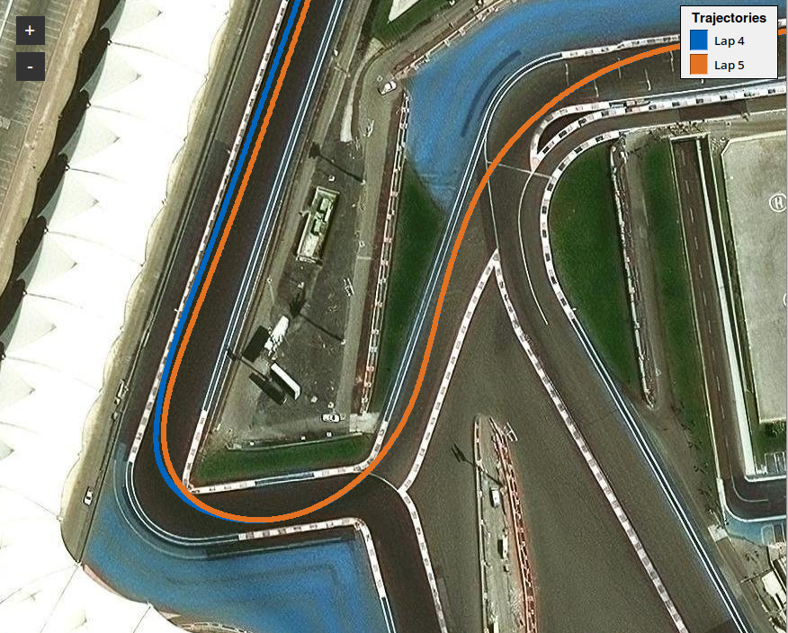

# Standalone Analysis Tools

Run these commands from the repository root after activating the environment.
Both tools are import-safe.

## Satellite Trajectory Viewer

`plot_trajectories.py` overlays any number of local east/north trajectories in
an interactive GUI using Esri World Imagery. The exact shared geographic origin
must be supplied by the user. Visual output appears in the GUI window; the tool
does not write an image file.



```bash
python tools/plot_trajectories.py \
  --trajectory 'reference.csv,Reference,#0065bd,0,0' \
  --trajectory 'comparison.csv,Comparison,#e37222,1.2,-0.4' \
  --origin-lat 48.0 \
  --origin-lon 11.0
```

The trajectory specification is
`PATH[,LABEL[,COLOR[,X_OFFSET[,Y_OFFSET]]]]`. The default coordinate columns
are `pos_x_m` and `pos_y_m`; override them with `--x-column` and `--y-column`.

The GUI uses `tkintermapview`, installed by `requirements.txt`. Tile requests
disclose the client IP address and requested map area to Esri. Verify current
provider terms and attribution requirements before publishing images of the
viewer.

The local-to-geographic conversion is an equirectangular WGS84 approximation
intended for track-scale distances. It is not suitable for large regions,
high-latitude work, or survey-grade coordinate conversion.

## CAN Log Conversion

`can_decoder.py` converts compact or bracketed candump CAN/CAN FD logs using a
validated JSON signal definition.

```bash
python tools/can_decoder.py input.log definitions.json output.csv \
  --format wide --filter-duplicates --verbose
```

`long` output contains one row per decoded signal. `wide` output contains one
sparse row per decoded message and qualifies signal names when the same name is
used by multiple messages.

The definition format is:

```json
{
  "params": [
    {
      "canId": "0x123",
      "name": "VehicleStatus",
      "isExtendedFrame": false,
      "signals": [
        {
          "name": "speed",
          "startBit": 0,
          "bitLength": 16,
          "isLittleEndian": true,
          "isSigned": false,
          "factor": 0.01,
          "offset": 0.0,
          "postfixMetric": "m/s"
        }
      ]
    }
  ]
}
```

`isExtendedFrame` defaults to `true` for IDs above `0x7FF` and `false` for lower
IDs. Set it explicitly to decode an extended frame whose numeric ID is at or
below `0x7FF`; candump represents such IDs with eight hexadecimal digits.
`isLittleEndian` and `isSigned` default to `false`; `factor`, `offset`, and
`postfixMetric` default to `1`, `0`, and an empty string. Big-endian start bits
follow standard DBC Motorola numbering.
